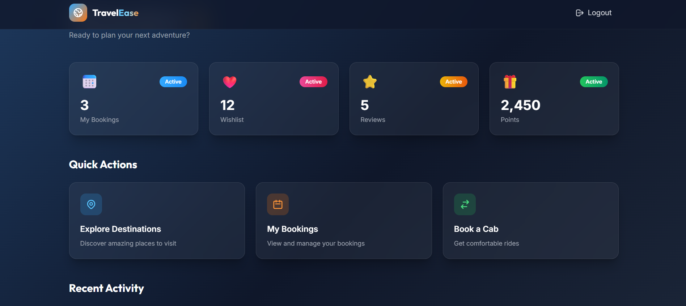
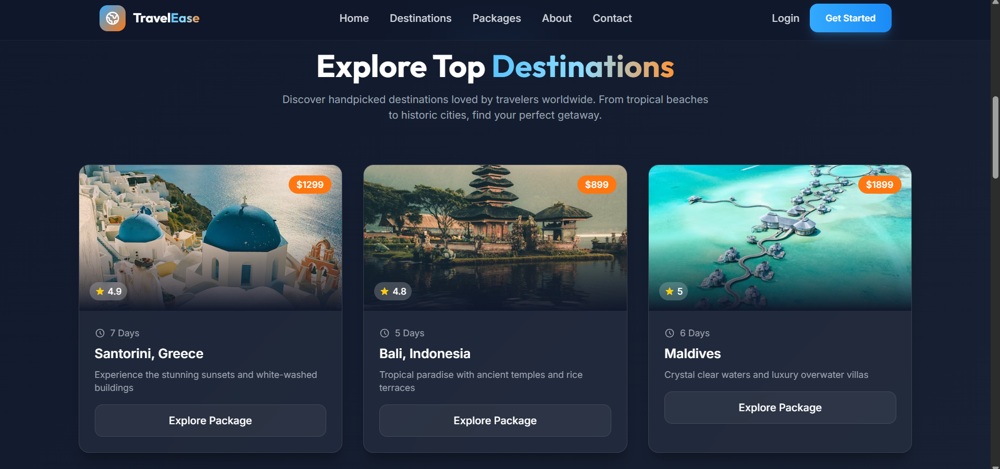
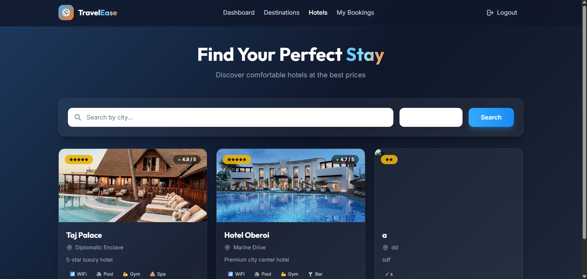
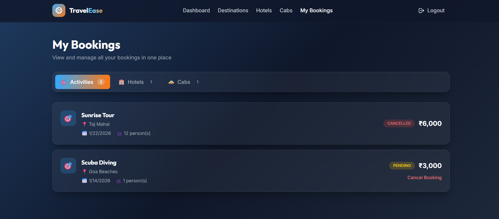
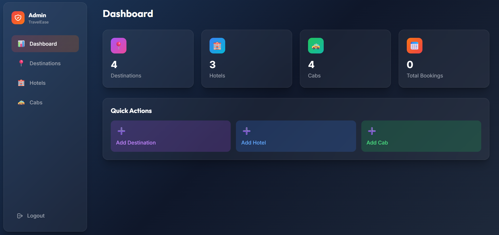

# 🌍 TravelEase - Integrated Travel Management System

A full-stack travel management platform built with **Spring Boot 3** backend and **React + TypeScript + TailwindCSS** frontend. Features include destinations exploration, hotel bookings, cab rentals, Razorpay payments, and a comprehensive admin panel.


---

## 🚀 Features

### 👤 User Features
- **Authentication** - Register/Login with JWT tokens & BCrypt password hashing
- **Explore Destinations** - Browse destinations by category (Beach, Mountain, Heritage, etc.)
- **Book Activities** - Book activities at destinations with participant count
- **Find Hotels** - Search hotels by city, view rooms, and book stays
- **Book Cabs** - Browse cabs by vehicle type and book rides with fare estimate
- **My Bookings** - View and manage all bookings (activities, hotels, cabs)
- **Payment Integration** - Secure payments via Razorpay with pending payment tracking
- **Premium Dashboard** - Real-time stats, recent activity, and points system

### 💳 Payment Features (Razorpay)
- Cart-style checkout for multiple bookings
- Select which bookings to pay
- Real-time total calculation
- Secure Razorpay checkout
- Automatic booking confirmation after payment
- Pending payment alerts on dashboard

### 🔐 Admin Features (Hidden Portal)
- **Secure Admin Login** - Separate admin authentication at `/admin-portal`
- **Dashboard** - Overview stats for destinations, hotels, and cabs
- **Manage Destinations** - Add, view, and delete destinations
- **Manage Hotels** - Add, view, and delete hotels
- **Manage Cabs** - Add, view, and delete cabs

---

## 📸 Screenshots

### User Dashboard


### Destinations


### Hotels


### My Bookings


### Admin Dashboard


---

## 🏗️ Tech Stack

| Layer | Technology |
|-------|------------|
| **Backend** | Spring Boot 3, Spring MVC, Spring Security 7 |
| **Frontend** | React 18, TypeScript, TailwindCSS, Vite |
| **Database** | MySQL, Hibernate JPA |
| **Auth** | JWT (JSON Web Tokens), BCrypt |
| **Payments** | Razorpay |
| **API Docs** | Swagger 3 / Springdoc |
| **Build** | Maven (Backend), npm (Frontend) |

---

## 📁 Project Structure

```
├── src/main/java/com/tour/Integrated/Travel/Management/
│   ├── config/           # Security, JWT, CORS configuration
│   ├── Controller/       # REST API endpoints
│   ├── Service/          # Business logic
│   ├── Repository/       # Data access layer
│   ├── Model/            # Entity classes
│   ├── dto/              # Request/Response DTOs
│   ├── Transformers/     # Entity to DTO mappers
│   └── Enum/             # Enumerations
│
├── frontend/src/
│   ├── pages/            # React page components
│   │   ├── admin/        # Admin portal pages
│   │   ├── Dashboard.tsx # Premium user dashboard
│   │   ├── Payment.tsx   # Razorpay checkout page
│   │   └── ...
│   ├── components/       # Reusable UI components
│   │   ├── Packages.tsx  # Travel packages section
│   │   ├── About.tsx     # About us section
│   │   └── ...
│   └── services/         # API service layer
```

---

## ⚙️ Getting Started

### Prerequisites
- Java 17+
- Node.js 18+
- MySQL 8+
- Maven

### 1️⃣ Clone the Repository
```bash
git clone https://github.com/your-username/integrated-travel-management.git
cd integrated-travel-management
```

### 2️⃣ Configure Database & Razorpay
Update `src/main/resources/application.properties`:
```properties
spring.datasource.url=jdbc:mysql://localhost:3306/travel_db?createDatabaseIfNotExist=true
spring.datasource.username=root
spring.datasource.password=your_password
spring.jpa.hibernate.ddl-auto=update

# Razorpay Configuration
razorpay.key.id=your_razorpay_key_id
razorpay.key.secret=your_razorpay_key_secret
```

### 3️⃣ Run Backend
```bash
./mvnw spring-boot:run
```

### 4️⃣ Run Frontend
```bash
cd frontend
npm install
npm run dev
```

### 5️⃣ Access Application
- **Frontend**: http://localhost:5173
- **Backend API**: http://localhost:8080
- **Swagger Docs**: http://localhost:8080/swagger-ui/index.html
- **Admin Portal**: http://localhost:5173/admin-portal

---

## 🔐 Authentication

### User Registration
```http
POST /api/auth/register
Content-Type: application/json

{
  "name": "John Doe",
  "email": "john@example.com",
  "password": "password123"
}
```

### User Login
```http
POST /api/auth/login
Content-Type: application/json

{
  "email": "john@example.com",
  "password": "password123"
}
```

### Admin Setup
```http
POST /api/auth/setup-admin
```
*Creates admin account: `admin@travelease.com` / `admin123`*

---

## 📦 Modules

| Module | Backend | Frontend |
|--------|---------|----------|
| **Destinations** | ✅ CRUD + Activities | ✅ List, Detail, Booking |
| **Hotels** | ✅ CRUD + Rooms + Bookings | ✅ Search, Detail, Room Booking |
| **Cabs** | ✅ CRUD + Bookings + Fare | ✅ Filter, Book with Estimate |
| **Admin Panel** | ✅ Role-based Auth | ✅ Dashboard + CRUD |
| **Payments** | ✅ Razorpay Integration | ✅ Checkout Page |
| **Dashboard** | ✅ User Stats API | ✅ Premium UI with Real Data |

---

## 💳 Payment Flow

1. User books hotels/cabs/activities → Status = `PENDING`
2. Navigate to **My Bookings** → Click **"Pay Now"**
3. Select bookings to pay → Click **"Pay ₹X"**
4. Razorpay checkout opens → Complete payment
5. Bookings updated to `CONFIRMED`

### Test Card (Razorpay Test Mode)
- Card: `4111 1111 1111 1111`
- CVV: Any 3 digits
- Expiry: Any future date

---

## 🛡️ Security Features

- JWT-based stateless authentication
- BCrypt password hashing
- Role-based access control (TOURIST, GUIDE, ADMIN)
- Hidden admin portal (no public links)
- CORS configured for frontend
- Secure payment signature verification

---

## 🤝 Contributing

Contributions are welcome! Feel free to:
- Fork the repository
- Create a feature branch
- Submit a pull request

---

## 📄 License

This project is for educational purposes.

---

**Built with ❤️ using Spring Boot & React**