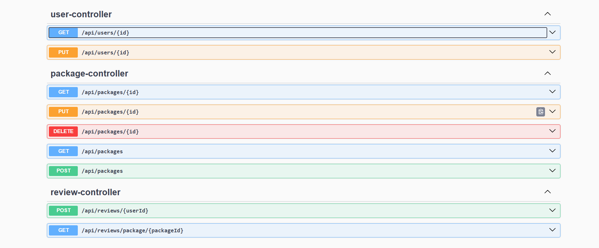
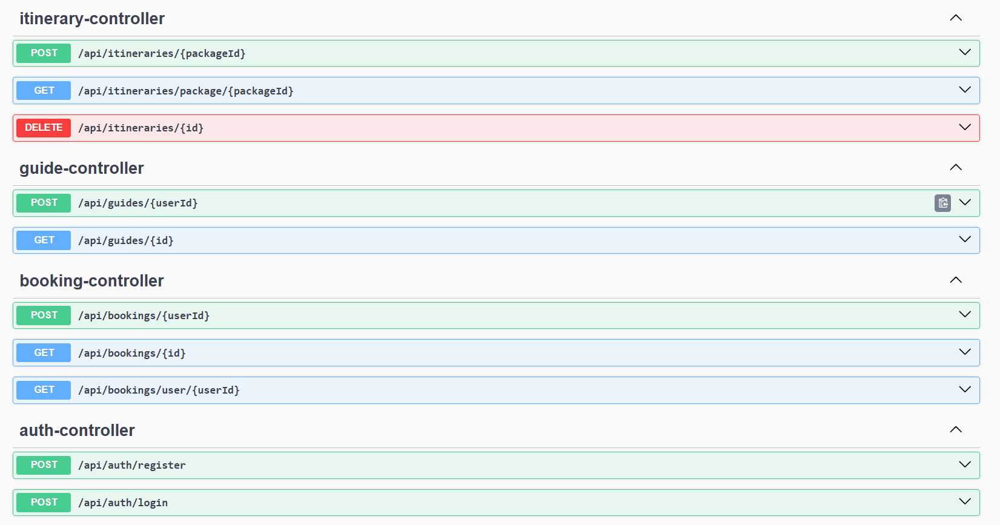
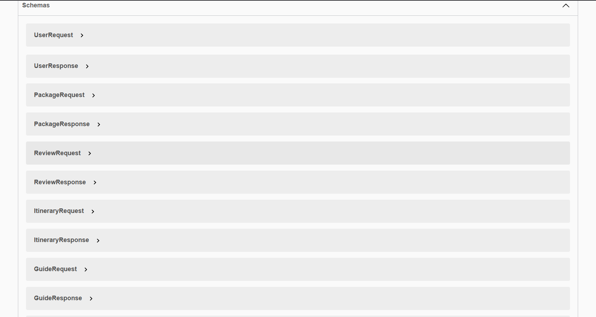
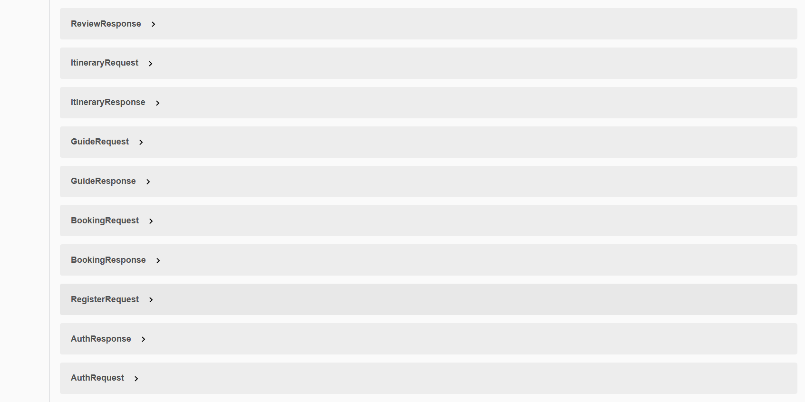

🧳 Integrated Travel Management System – Spring Boot (JWT + MySQL + Swagger)

A production-style backend system that manages tour packages, bookings, itineraries, guides, reviews, and user authentication — built with Spring Boot 3, Spring Security 7, JWT, Hibernate, and MySQL.

🚀 Features 
🔐 Authentication & Authorization

Register/Login using JWT

Password hashing using BCrypt

Stateless security structure

Role-based access ready (TOURIST / ADMIN)

🧳 Tour Package Module

Create new tour packages

Update package details

Fetch all packages

Delete package

Auto-decrements seats on booking

Handles concurrent seat updates safely

📝 Booking Module

Book a tour package

Prevents over-booking

Uses optimistic locking + retry mechanism

User-wise bookings retrieval

🗓️ Itinerary Module

Add itinerary items for packages

Update / delete itinerary entries

Sorted retrieval (Day-wise)

⭐ Review Module

Add reviews for tour packages

Restriction: only authenticated user

Fetch reviews by package

🧑‍✈️ Guide Module

Assign guide to a user

Guide list + details

🏗️ Tech Stack
Layer	Tech
Backend	Spring Boot 3, Spring MVC
Security	Spring Security 7, JWT
DB	MySQL, Hibernate
Build	Maven
Docs	Swagger 3 / Springdoc
📌 Project Structure
src/main/java/com/tour/Integrated/Travel/Management
│
├── config/  
│   ├── SecurityConfig.java  
│   ├── JwtUtil.java  
│   └── JwtAuthenticationFilter.java  
│
├── controller/  
│   ├── AuthController.java  
│   ├── PackageController.java  
│   ├── BookingController.java  
│   ├── ReviewController.java  
│   ├── GuideController.java  
│   └── ItineraryController.java  
│
├── dto/
│   ├── request/
│   ├── response/
│
├── transformer/
│   ├── PackageTransformer.java  
│   ├── BookingTransformer.java  
│   ├── ReviewTransformer.java  
│   ├── GuideTransformer.java  
│   └── ItineraryTransformer.java  
│
├── service/
│   ├── PackageService.java  
│   ├── BookingService.java  
│   ├── ReviewService.java  
│   ├── GuideService.java  
│   └── ItineraryService.java  
│
└── model/

⚙️ How to Run
1️⃣ Clone the project
git clone https://github.com/your-username/integrated-travel-management.git
cd integrated-travel-management

2️⃣ Configure database

Update application.properties:

spring.datasource.url=jdbc:mysql://localhost:3306/travel_db?createDatabaseIfNotExist=true
spring.datasource.username=root
spring.datasource.password=root

spring.jpa.hibernate.ddl-auto=update
spring.jpa.show-sql=true

3️⃣ Run the project
mvn spring-boot:run

🔐 Authentication Flow
Register
POST /api/auth/register
{
"name": "Punith",
"email": "punith@gmail.com",
"password": "12345"
}

Login
POST /api/auth/login
{
"email": "punith@gmail.com",
"password": "12345"
}

Response:

{
"token": "JWT_TOKEN_HERE"
}

Use it in Swagger or Postman:

Authorization: Bearer <JWT>

📘 Swagger Documentation

Once the app is running, open:

http://localhost:8080/swagger-ui/index.html

📸 Screenshots

🤝 Contributing

Feel free to fork and PR improvements — like role-based admin access, payment integration, more analytics, etc.